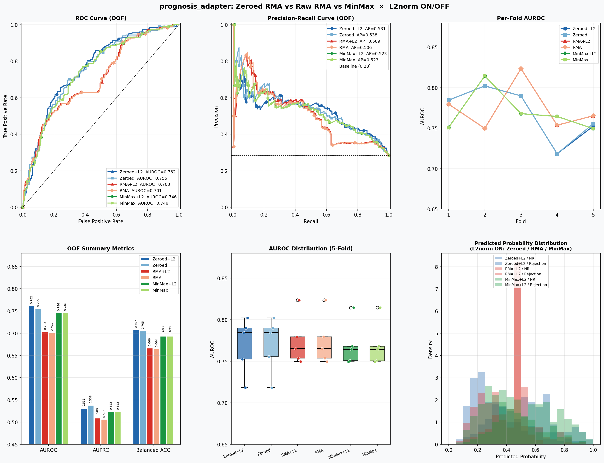
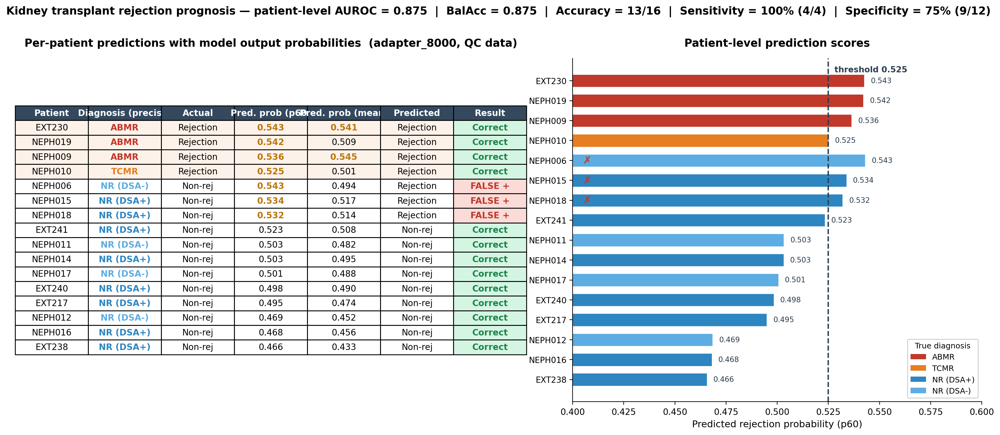

# Microarray-to-scRNA Prognosis Adapter

작성일: 2026-06-01

이 문서는 `prognosis_microarray_adapter.py`로 정리한 최종 microarray-to-scRNA 예후 예측 모델을 요약한다. 목표는 bulk microarray에서 학습한 rejection/prognosis signal을 scGPT kidney pretrained encoder의 single-cell 표현 공간으로 옮기고, single-cell 환자 데이터에서는 세포별 risk를 환자 수준 score로 집계하는 것이다.

## 한 줄 결론

최종 모델은 frozen scGPT kidney encoder를 보존하고, 그 위에 residual Microarray-to-SC adapter와 prognosis head만 학습하는 구조다. 5-fold OOF 비교에서는 Zeroed RMA + L2 normalization 설정이 AUROC 0.762, balanced accuracy 0.707로 가장 강한 기준 모델이었다.

## Pipeline

```text
microarray sample
  -> RMA/log2 expression preprocessing
  -> nonzero gene tokenization
  -> per-sample quantile binning
  -> frozen scGPT kidney encoder
  -> CLS embedding, 512 dim
  -> Microarray-to-SC residual adapter
  -> L2 normalization
  -> prognosis head
  -> rejection probability / risk score
```

Single-cell prediction에서는 같은 model checkpoint를 cell 단위로 적용한 뒤, 환자별 cell probability 분포를 요약한다.

```text
single-cell h5ad
  -> cell-level probability
  -> patient-level p60 probability
  -> patient risk table
```

## Model Architecture

| 모듈 | 역할 |
| --- | --- |
| scGPT encoder | `models/pretrain_kidney`의 gene/value encoder와 Transformer encoder를 로드한다. |
| Frozen encoder | microarray 학습 신호가 single-cell pretrained manifold를 크게 흔들지 않도록 encoder weight를 freeze한다. |
| Microarray-to-SC adapter | `LayerNorm -> Linear(512, 256) -> GELU -> Dropout -> Linear(256, 512) -> residual add` 구조다. 마지막 linear는 zero-init되어 adapter가 identity에서 시작한다. |
| L2 normalization | adapter 이후 CLS embedding 방향 정보를 중심으로 head가 학습하게 한다. 기본값은 on이다. |
| Prognosis head | shared MLP 뒤에 binary branch와 Cox branch를 둔다. 현재 학습은 BCE 기반 NR vs Rejection binary objective가 중심이다. |

중요한 구현상 주의점은 Cox branch다. 코드에는 Cox risk output과 Cox partial likelihood 함수가 있지만, 현재 `finetune` command에서는 `Cox loss: DISABLED (BCE only)`로 고정되어 있다. 따라서 현 버전의 주된 예후 score는 time-to-event survival model이 아니라 rejection probability 기반 risk score로 해석하는 것이 안전하다.

## Training

학습은 bulk microarray `.h5ad`를 입력으로 받는다.

- 5-fold stratified CV를 수행한다.
- 각 fold train split에서 `pos_weight`를 계산해 validation leakage를 줄인다.
- optimizer는 trainable parameter, 즉 adapter와 head에만 AdamW를 적용한다.
- scheduler는 cosine annealing을 사용한다.
- validation AUROC 기준 early stopping을 적용한다.
- fold별 best state와 전체 training data로 재학습한 `final_model.pt`를 저장한다.
- OOF prediction을 모아 `cv_metrics.json`과 `oof_predictions.csv`를 만든다.

기본 hyperparameter는 다음과 같다.

| 항목 | 기본값 |
| --- | --- |
| `adapter_dim` | 256 |
| `hidden_dim` | 256 |
| `dropout` | 0.2 |
| `max_seq_len` | 8000 |
| `n_folds` | 5 |
| `epochs` | 60 |
| `patience` | 15 |
| `head_lr` | 1e-4 |
| `weight_decay` | 1e-2 |

## Tokenization and Preprocessing

입력 gene은 scGPT vocab과 매칭되는 gene만 사용한다. 각 sample 또는 cell에서 expression이 0보다 큰 gene만 뽑고, gene 수가 `max_seq_len - 1`보다 많으면 random subset을 선택한다.

Expression value는 sample 단위 quantile binning으로 scGPT value token에 맞춘다. Raw count pseudobulk나 single-cell raw count에는 `--normalize`를 켜서 `normalize_total(1e4) -> log1p`를 적용한다. RMA microarray처럼 이미 log-scale로 정리된 입력에는 `--normalize`를 쓰지 않는 것이 기본이다.

## Evaluation Snapshot

아래 그림은 Zeroed RMA, raw RMA, MinMax 전처리와 L2 normalization on/off 조합을 비교한 OOF 결과다.



| 설정 | OOF AUROC | AUPRC | Balanced ACC |
| --- | ---: | ---: | ---: |
| Zeroed + L2 | 0.762 | 0.531 | 0.707 |
| Zeroed | 0.755 | 0.538 | 0.705 |
| RMA + L2 | 0.703 | 0.509 | 0.666 |
| RMA | 0.701 | 0.506 | 0.664 |
| MinMax + L2 | 0.746 | 0.523 | 0.693 |
| MinMax | 0.746 | 0.523 | 0.693 |

해석은 보수적으로 둔다. Zeroed + L2가 AUROC와 balanced accuracy에서 가장 좋고, Zeroed without L2는 AUPRC가 약간 높다. 최종 기본 구조는 domain shift 안정성과 AUROC를 우선해 adapter + L2 normalization을 유지한다.

## Follow-up Validation

2026-06-01~02 WORKLOG에서 adapter_8000 계열의 후속 검증을 추가했다. 전체 맥락은 [scGPT Worklog Summary](scgpt-worklog-summary.md)에 정리했다.

| 검증 | 결과 | 해석 |
| --- | --- | --- |
| QC single-cell p60 prediction | AUROC 0.875, BalAcc 0.875, sensitivity 4/4, specificity 9/12 | QC 필터 후에도 rejection 4명 전원 검출 |
| p55/p60/p65 aggregation | p60: AUROC 0.875, BalAcc 0.875 | p60이 기본 patient score로 가장 균형적 |
| GSE39582 random-label negative control | OOF AUROC 0.515, patient AUROC 0.458 | pipeline artifact/label leakage 가능성을 낮춤 |
| kidney vs human backbone | kidney p60 AUROC 0.875, human p60 AUROC 0.500 | kidney-specific pretraining이 cross-domain transfer에 결정적 |
| MC-dropout sweep | ranking 거의 불변, uncertainty만 dropout에 따라 증가 | patient ranking이 dropout perturbation에 robust |
| attention pooling | array OOF 개선, sc transfer 악화 | cross-domain에서는 CLS readout이 더 robust |



## Prediction Outputs

`predict-bulk`는 bulk 또는 pseudobulk `.h5ad`에 fold checkpoints와 final checkpoint ensemble을 적용한다.

출력 컬럼:

- `sample_id`
- `prob`
- `cox_risk`
- optional `label`
- optional `time`
- optional `predicted`

`predict-cell`은 single-cell `.h5ad`에 cell-level prediction을 수행하고 환자별로 집계한다.

출력 컬럼:

- `patient_id`
- `n_cells`
- `p60_prob`, 또는 지정한 quantile의 probability
- `mean_prob`
- `median_prob`
- `p60_risk`
- `mean_risk`
- optional `label`
- optional `time_days`
- optional `predicted`

기존 rejection transfer 실험에서 patient-level p60 aggregation이 가장 안정적이었기 때문에, 기본 patient score는 `--quantile 60`을 사용한다.

## Quick Commands

Fine-tuning:

```bash
python3 scripts/prognosis_microarray_adapter.py finetune \
  --adata scgpt_training_data.h5ad \
  --model-dir models/pretrain_kidney \
  --label-col condition \
  --positive-label Rejection \
  --output-base results/prognosis_adapter
```

Single-cell patient prediction:

```bash
python3 scripts/prognosis_microarray_adapter.py predict-cell \
  --adata E-MTAB-12051/E_MTAB_12051.h5ad \
  --normalize \
  --model-dir models/pretrain_kidney \
  --checkpoint-dir results/prognosis_adapter/run_YYYYMMDD-HHMMSS \
  --patient-col orig.ident \
  --label-col condition \
  --positive-label Rejection \
  --time-col sampling_time_point \
  --quantile 60 \
  --plot \
  --output results/prognosis_adapter/predict_cell_p60.csv
```

Pseudobulk prediction:

```bash
python3 scripts/prognosis_microarray_adapter.py predict-bulk \
  --adata E-MTAB-12051/E_MTAB_12051_pseudobulk.h5ad \
  --normalize \
  --model-dir models/pretrain_kidney \
  --checkpoint-dir results/prognosis_adapter/run_YYYYMMDD-HHMMSS \
  --label-col condition \
  --positive-label Rejection \
  --output results/prognosis_adapter/predict_bulk.csv
```

## Interpretation

이 모델의 핵심은 microarray 학습 데이터가 scGPT pretraining domain과 다르다는 점을 명시적으로 인정하는 것이다. Encoder 전체를 업데이트하지 않고 작은 residual adapter만 학습하면, bulk microarray에서 얻은 supervised signal을 single-cell pretrained representation 위에 얹을 수 있다.

다음 검증에서는 단순 AUROC뿐 아니라 patient-level calibration, threshold stability, p60 score margin, external cohort 성능을 같이 봐야 한다. Time-to-event endpoint가 충분해지면 Cox branch를 실제 loss에 연결해 rejection-free survival 또는 graft survival model로 확장할 수 있다.

## 관련 문서

- [Transplant Prognosis Model Notes](transplant-prognosis-model-notes.md)
- [Kidney Transplant Rejection Classification](kidney-transplant-rejection-classification-summary.md)
- [scGPT Worklog Summary](scgpt-worklog-summary.md)
- [Prognosis Microarray Adapter Code Log](../code/logs/2026-06-01-prognosis-microarray-adapter.md)
