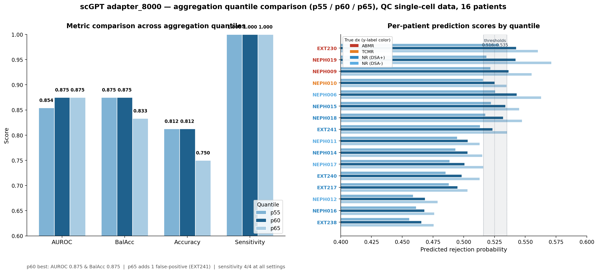
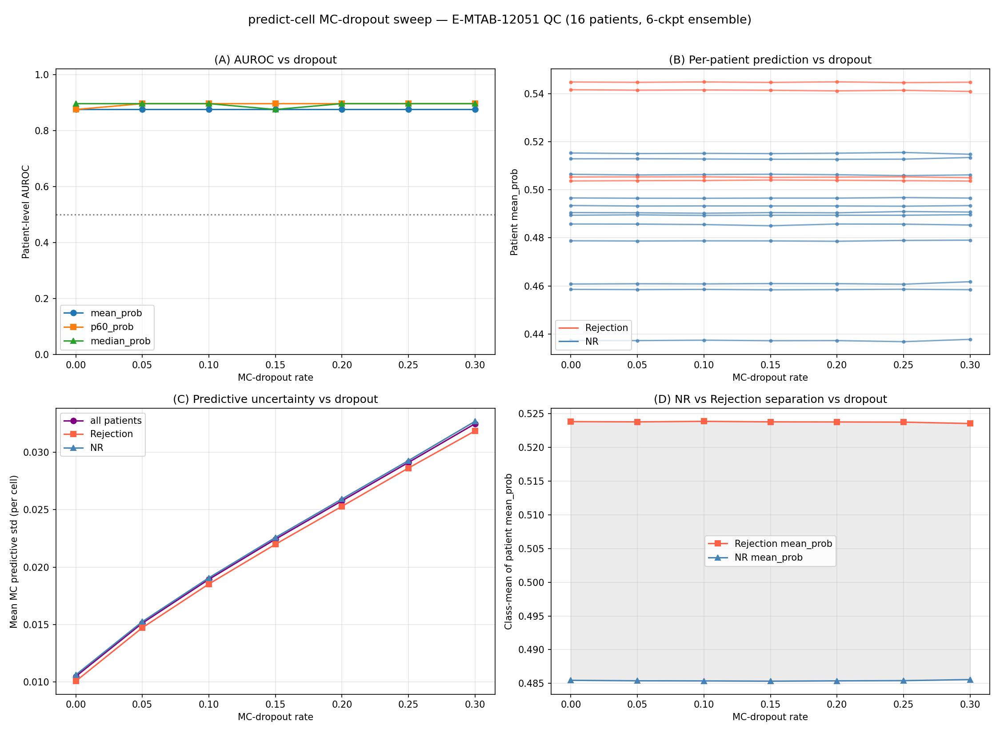

# scGPT Worklog Summary

작성일: 2026-06-04

이 문서는 `/Users/dwyun/WORKLOG.md`에 누적된 scGPT 기반 신장 이식 거부반응/예후 예측 실험을 위키용으로 정리한 요약 보고서다. 원본 전체 로그는 [scGPT full worklog](../code/logs/2026-06-04-scgpt-worklog.md)에 보존했다.

## 한 줄 결론

Bulk microarray에서 single-cell RNA-seq 환자 예측으로 가는 방향은 `pretrain_kidney` scGPT 표현과 patient-level aggregation이 강하게 작동했다. 반대로 scRNA-seq에서 microarray로 zero-shot 전사하는 방향은 여러 표현, domain adaptation, UDA, self-training을 모두 소진해도 AUROC 0.748 근처에서 포화되며, microarray 라벨 감독 또는 rejection prior 없이는 0.80 이상이 어렵다는 결론에 도달했다.

## 최종 권장 그림

현재 가장 실용적인 최종 모델 계열은 두 축으로 나뉜다.

| 목적 | 권장 접근 | 핵심 수치 |
| --- | --- | --- |
| bulk microarray -> scRNA-seq 환자 예측 | `prognosis_adapter_8000`, frozen `pretrain_kidney`, residual adapter, patient aggregation | QC single-cell p60 AUROC 0.875, BalAcc 0.875 |
| scRNA-seq -> microarray zero-shot 전사 | scGPT gene-embedding projection + quantile/self-training 계열 | honest zero-shot ceiling 약 0.748 |
| microarray supervised 평가 | array label을 허용한 scGPT-embedding classifier | 5x5-fold CV AUROC 0.840 |
| 무학습 prior 기반 상한 확인 | scGPT-weighted rejection signature | AUROC 약 0.816 |

## 2026-06-01 이후 핵심 검증

### adapter_8000 QC single-cell prediction

`results/prognosis_adapter_8000/run_20260528-022429`를 QC 필터링된 `E_MTAB_12051_qc.h5ad`에 적용했다. 37,920 cells, 16 patients, 6-checkpoint ensemble, `--quantile 60` 조건에서 환자 단위 AUROC 0.875, balanced accuracy 0.875, accuracy 13/16을 얻었다. Rejection 4명은 모두 검출했고, 오류 3건은 모두 NR false positive였다.

Quantile aggregation 비교에서는 p55, p60, p65 모두 rejection 4명을 검출했다. p60은 AUROC와 balanced accuracy가 함께 높아 기본값으로 유지할 만하다.

### kidney vs human backbone

동일한 `prognosis_adapter_8000` 옵션에서 `--model-dir`만 `models/pretrain_kidney`에서 `models/pretrain_human`으로 바꿔 비교했다.

| 지표 | kidney backbone | human backbone |
| --- | ---: | ---: |
| 5-fold OOF AUROC | 0.776 | 0.799 |
| predict-cell p60 AUROC | 0.875 | 0.500 |
| rejection recall | 4/4 | 1/4 |

Human backbone은 microarray training OOF에서는 더 좋아 보였지만, single-cell 환자 전이에서는 완전히 붕괴했다. 이 결과는 in-domain fit과 cross-domain transfer가 별개이며, kidney-specific pretraining이 bulk array -> scRNA-seq 전이에 핵심이라는 결론을 강화한다.

### negative control

GSE39582 대장암 microarray에 랜덤 NR/Rejection 라벨을 붙여 동일 파이프라인을 학습했다. 랜덤 라벨에서는 5-fold OOF AUROC 0.515, predict-cell 환자 AUROC 0.458로 우연 수준에 머물렀다. 실제 adapter_8000의 0.776/0.875와 대비되므로, 기존 prognosis 신호가 단순 누수나 pipeline artifact가 아니라는 음성 대조가 성립한다.

### MC-dropout sweep

`predict-cell`에 MC-dropout을 활성화한 복사본을 만들어 dropout 0.00부터 0.30까지 비교했다. 환자별 순위와 AUROC는 거의 변하지 않았고, MC uncertainty만 dropout에 따라 선형적으로 증가했다. 즉 모델의 patient ranking은 dropout perturbation에 robust하다.

### attention-pooling readout

CLS 대신 전체 token sequence에 learnable query attention pooling을 붙인 변형을 실험했다. Array OOF는 CLS 0.746에서 attention-pooling 0.770으로 좋아졌지만, cross-domain single-cell prediction은 mean 0.562/p60 0.479로 악화했다. 추가 용량이 array domain에는 적합하지만 scRNA-seq 전이 robustness를 잃는 패턴이다.

## sc -> array zero-shot 결론

WORKLOG에서 가장 큰 실험 묶음은 `scgpt_sc_to_array.py` 계열이다. 순수 scGPT embedding 기반으로 scRNA-seq source에서 microarray target으로 전사하려고 표현, domain adaptation, classifier, SSL/UDA를 거의 전수 탐색했다.

핵심 진단:

- `cosine(w_sc, w_array) = 0.076`: sc에서 학습한 rejection 축과 array에서 최적인 rejection 축이 거의 직교한다.
- Array unsupervised structure는 rejection과 강하게 연결되지 않는다.
- Array label이 있으면 cross-batch AUROC 0.846까지 가능하므로 target에 신호가 없는 것은 아니다.
- 문제는 sc source의 판별축이 array target의 판별축으로 직접 전사되지 않는다는 점이다.

최종 판정:

| 설정 | 최고 결과 | 해석 |
| --- | ---: | --- |
| zero-shot honest seed | 약 0.698 | proj + quantile + LR |
| transductive co-training / denoising | 약 0.748 | label-free ceiling |
| QC source + general self-training | 0.740 | 범용 단일뷰 self-training |
| array-supervised scGPT embedding | 0.840 | task를 바꾸면 0.80 이상 가능 |

따라서 zero-shot sc -> array만으로 AUROC 0.80을 넘기는 경로는 없다고 정리한다. 0.80 이상이 필요하면 array 감독을 허용하거나, scGPT-weighted rejection signature처럼 biology prior를 도입해야 한다.

## Timeline

| 날짜 | 핵심 작업 | 결론 |
| --- | --- | --- |
| 2026-05-04 | B17 vs B25_CTRL cell-level scGPT fine-tuning | cell split 기준 test AUROC 0.960, 환자 단위 일반화는 별도 필요 |
| 2026-05-14 | GSE147089 RMA bug 수정 | background correction underflow를 고쳐 정상 log2 범위 복원 |
| 2026-05-18 | bulk array -> scRNA-seq domain transfer | `pretrain_kidney` embedding과 p60 aggregation 방향이 유망 |
| 2026-05-20 | p60 reproduction pipeline | p60 patient score AUC 1.000, bootstrap mean 0.945 |
| 2026-05-22~24 | end-to-end fine-tuning v1/v2 | CV가 좋아도 full fine-tuning은 scRNA-seq test에서 specificity collapse |
| 2026-05-26~27 | nonzero tokenization, v3/v5, prognosis adapter | frozen encoder + adapter/head 방향으로 수렴 |
| 2026-05-29~31 | sc -> microarray v2~v18 전수 탐색 | zero-shot ceiling 약 0.748, array-supervised는 0.840 |
| 2026-06-01 | QC h5ad, negative control, adapter_8000 QC prediction | QC p60 AUROC 0.875, random-label negative control 성립 |
| 2026-06-02 | human backbone, MC-dropout, attention pooling | kidney-specific backbone과 CLS robustness 재확인 |

## 설계 원칙으로 남길 것

- Cross-domain transfer에서는 OOF/CV 성능보다 target-domain patient ranking을 우선한다.
- Non-single-cell training signal로 scGPT encoder 전체를 업데이트하면 single-cell pretrained manifold를 해칠 수 있다.
- `pretrain_kidney`와 `pretrain_human`의 차이는 단순 backbone 선택이 아니라 transfer viability의 핵심 변수다.
- Small-positive source, 특히 rejection 4명 같은 상황에서는 LR보다 centroid/prototype 계열이 더 robust할 수 있다.
- Raw scGPT Transformer CLS가 항상 좋은 표현은 아니다. 일부 sc -> array task에서는 gene-embedding table projection이 CLS보다 훨씬 안정적이었다.

## 관련 문서

- [Microarray-to-scRNA Prognosis Adapter](microarray-to-scrna-prognosis-adapter.md)
- [Kidney Transplant Rejection Classification](kidney-transplant-rejection-classification-summary.md)
- [Transplant Prognosis Model Notes](transplant-prognosis-model-notes.md)
- [scGPT full worklog](../code/logs/2026-06-04-scgpt-worklog.md)
